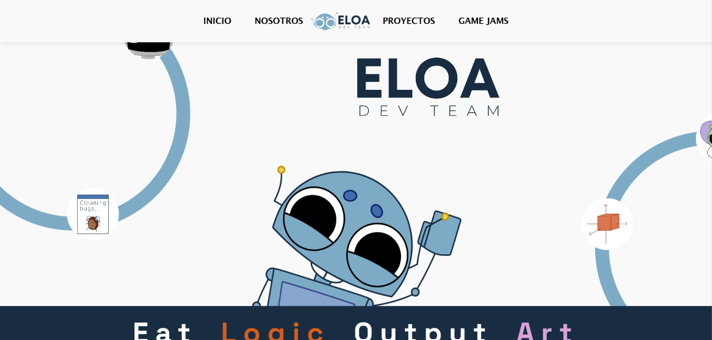
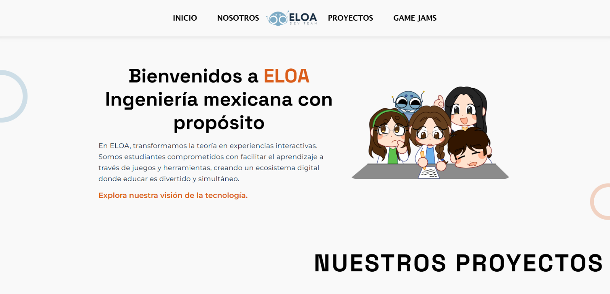
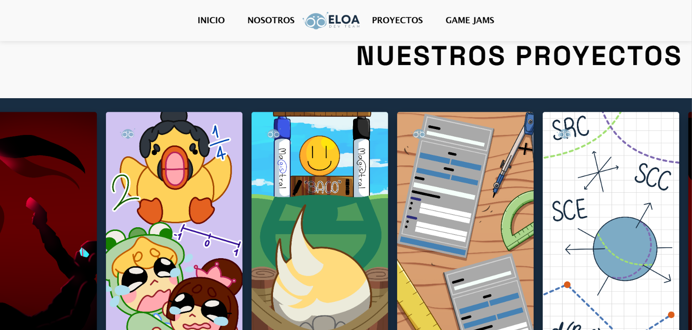

# Página de Inicio — ELOA Dev Team

Página principal del sitio de ELOA Dev Team. Es la primera página que ve el visitante: explica qué es ELOA, quiénes somos y muestra la lista de proyectos del equipo.

🔗 **Demo:** [Ver en línea](https://eloadev.github.io/proyectos/)

## Descripción

ELOA Dev Team es un grupo de desarrolladores universitarios de Hermosillo, Sonora, México. La página de inicio presenta al equipo y funciona como punto de entrada al portafolio, desde donde se puede acceder a cada uno de nuestros proyectos: guías, juegos e ideas enfocadas en aprender jugando.

## Cómo funciona

1. El visitante entra a la página y ve una presentación de ELOA.
2. Puede leer quiénes somos y a qué nos dedicamos.
3. Encuentra la lista de proyectos del equipo.
4. Al seleccionar un proyecto, entra a su página con la explicación, el juego o la herramienta y sus evidencias.

## Herramientas

- Astro
- HTML
- CSS
- JavaScript
- GitHub Pages

## Capturas

## Mi participación

- Desarrollo de la página de inicio.
- Estructura y redacción del contenido sobre el equipo y sus proyectos.

## Equipo

ELOA Dev Team
