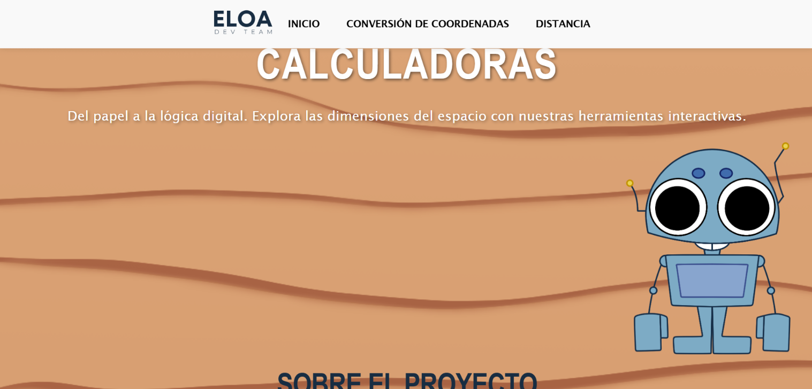
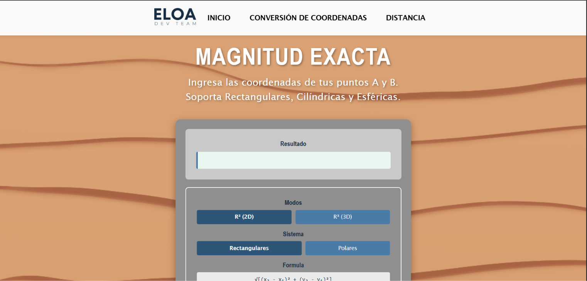
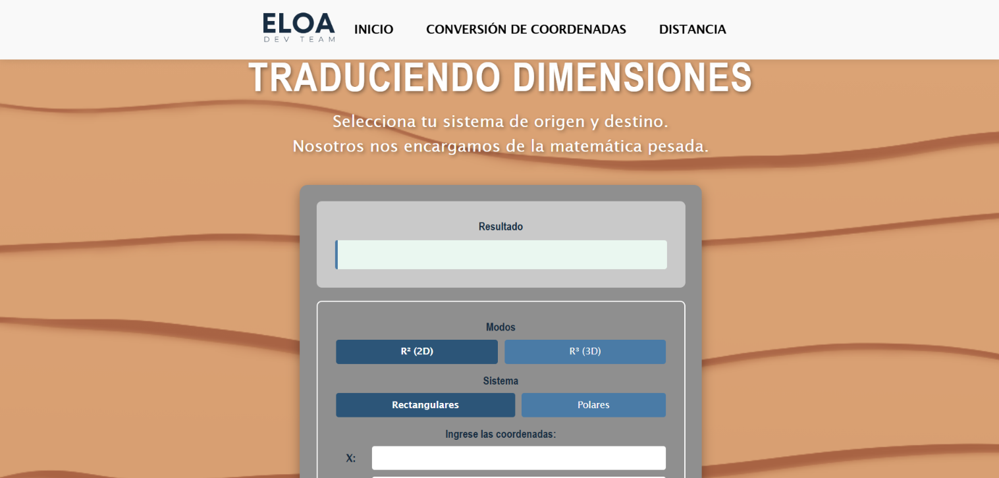

# Calculadoras de Coordenadas

Página web con **dos calculadoras interactivas** para calcular distancias y hacer conversiones de coordenadas, un tema de física.

🔗 **Demo:** [Ver en línea](https://eloadev.github.io/proyects/Calculadoras/calculadoras/)
🔗 **Código:** [Ver código de esta página](/portafolio-v2/src/pages/Calculadoras/)

## Descripción

Este proyecto ayuda a practicar y comprobar ejercicios de física relacionados con coordenadas. La página explica brevemente en qué consiste el tema e incluye dos herramientas interactivas que hacen los cálculos al momento.

## Cómo funciona

1. El usuario lee una breve explicación del proyecto.
2. Elige la calculadora que necesita:
   - **Distancias:** calcula la distancia entre puntos.
   - **Conversiones:** convierte coordenadas entre sistemas (por ejemplo, rectangulares y polares).
3. Ingresa los valores y la calculadora muestra el resultado.

## Herramientas

- Astro
- HTML
- CSS
- JavaScript (lógica de los cálculos)
- GitHub Pages

## Capturas

## Mi participación

- Desarrollé la página web del proyecto.
- Redacté la explicación del tema.

## Equipo

ELOA Dev Team
