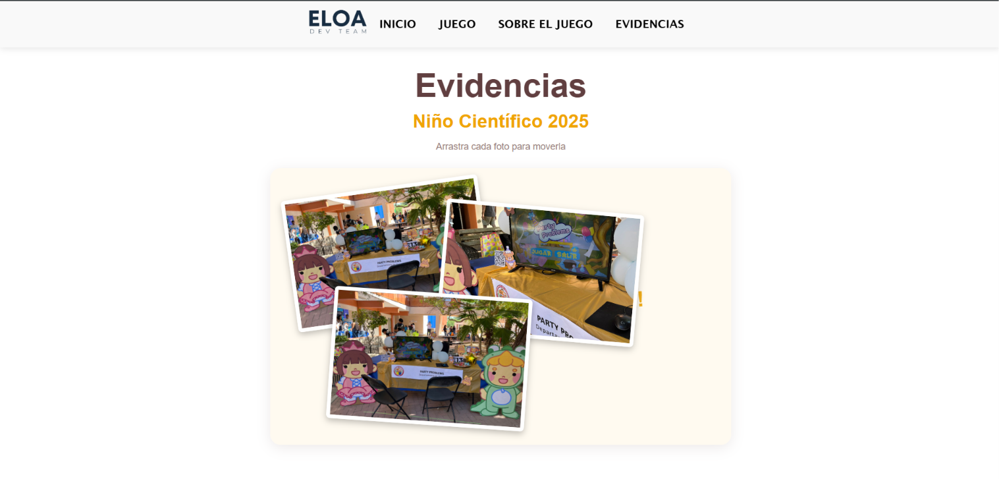
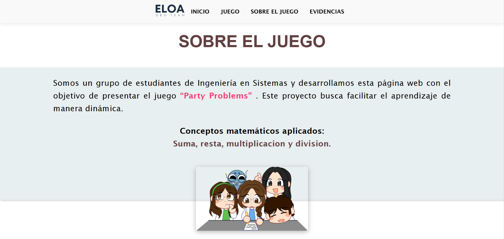
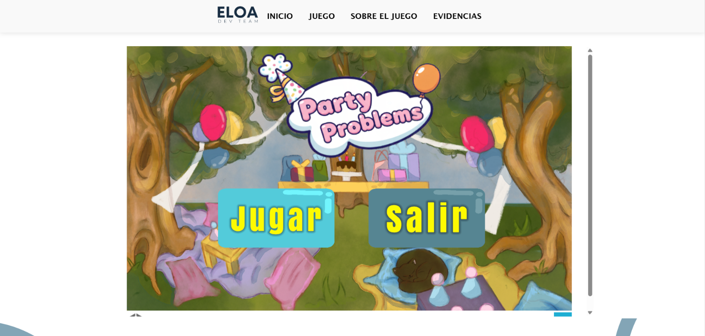

# Party Problems

Página web del proyecto **Party Problems**, un juego de matemáticas para niños de primaria desarrollado por ELOA Dev Team.

🔗 **Demo:** [Ver en línea](https://eloadev.github.io/proyects/party-problems/inicioParty/)
🔗 **Código:** [Ver código de esta página](portafolio-v2/src/pages/party-problems)

## Descripción

Party Problems es un juego educativo que ayuda a niños de primaria a practicar matemáticas de forma divertida. Esta página explica en qué consiste el juego, permite jugarlo directamente en el navegador y muestra las evidencias de los congresos donde hemos presentado el proyecto, como Rally de la Niñez 2025 y LUDICON 2026.

## Cómo funciona

1. El visitante lee una explicación breve del juego y su objetivo educativo.
2. Puede jugar Party Problems directamente desde la página (versión web de Unity).
3. Al final encuentra la sección de evidencias con fotos de las presentaciones en congresos.

## Herramientas

- Astro, HTML, CSS y JavaScript (página web)
- Unity y C# (juego)
- Unity WebGL (para jugar en el navegador)
- GitHub Pages

## Capturas

## Mi participación

- Desarrollé la página web del proyecto.
- Redacté la explicación del juego.
- Integré el juego para que se pueda jugar desde la página.
- Organicé la sección de evidencias de los congresos.

## Equipo

ELOA Dev Team
