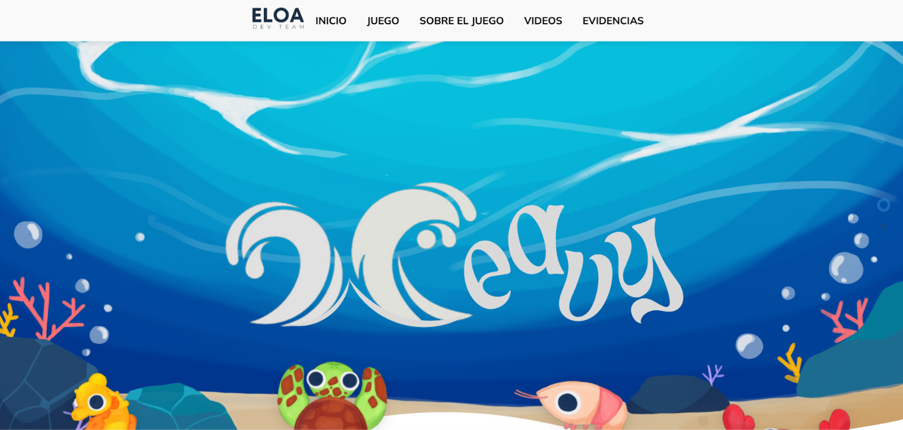
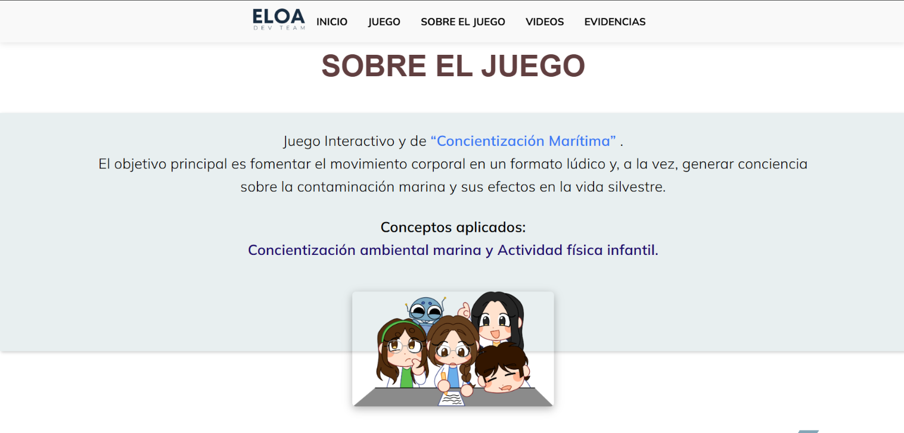

# Juego de Proyección Interactiva "Weavy"

Página web de un **juego de proyección interactiva** desarrollado por ELOA Dev Team.

🔗 **Demo:** [Ver en línea](URL-DEL-JUEGO-DE-PROYECCION)

## Descripción

Es un juego que se proyecta en una superficie y con el que los jugadores interactúan directamente. Esta página explica en qué consiste el proyecto, se puede jugar  y muestra las evidencias de los lugares donde lo hemos presentado.

## Cómo funciona

1. El visitante lee la explicación del proyecto y cómo se juega.
2. Encuentra la sección de evidencias con fotos de las presentaciones.

## Herramientas

- Astro, HTML, CSS y JavaScript (página web)
- Unity y C# (juego)
- Unity WebGL (para jugar en el navegador)
- GitHub Pages

## Capturas

## Mi participación

- Desarrollé la página web del proyecto.
- Redacté la explicación del juego.
- Subí e integré el juego en la página.
- Organicé la sección de evidencias.

## Equipo

ELOA Dev Team
